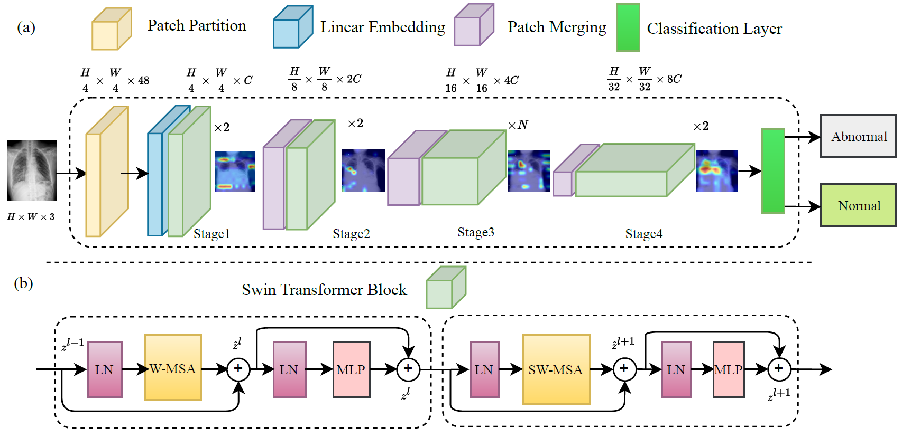
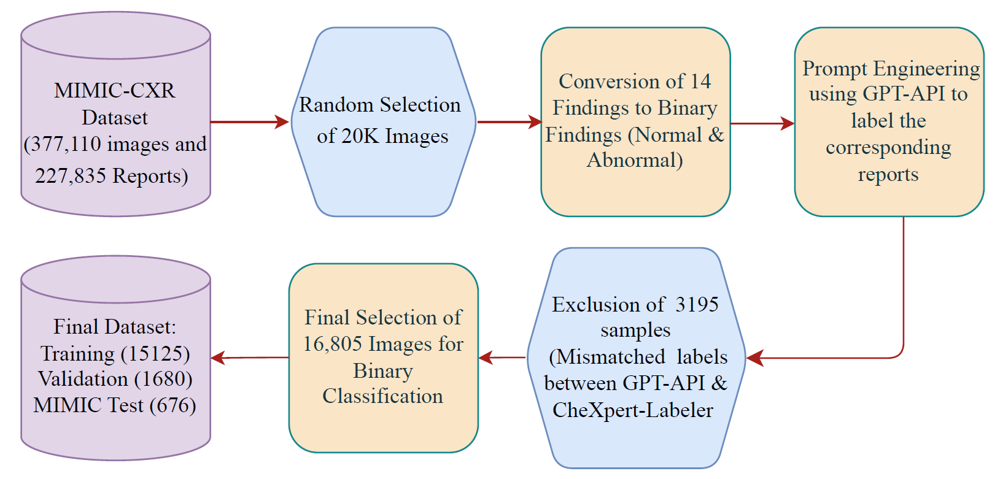
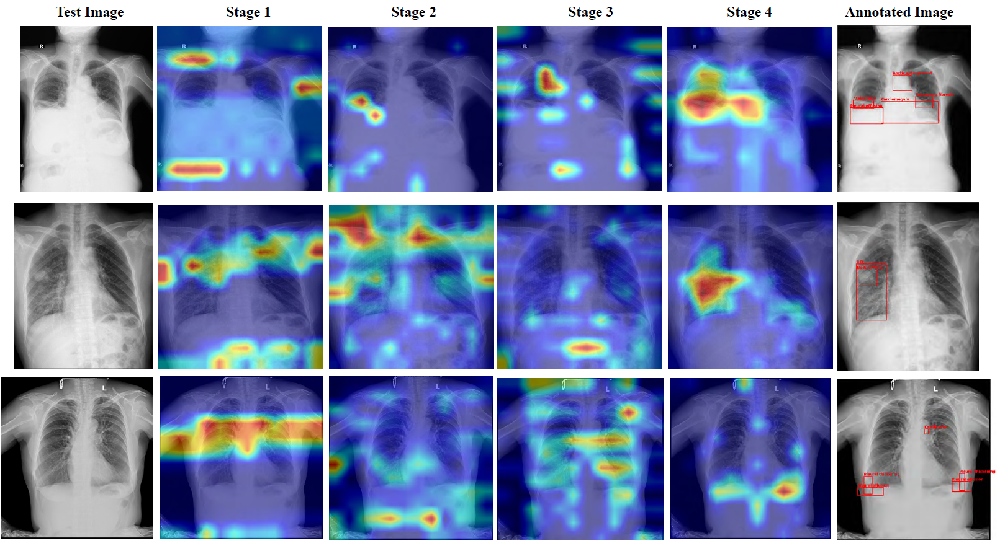

# Swin-Transformer-based-Vision-Encoder
Pursuing an Effective Vision Encoder for Enhancing Explainable X-Ray Report Generation

Recent advancements in vision encoders have shown promise in enhancing explainable X-ray report generation, a critical component in medical imaging. However, many existing studies often focus primarily on improving the accuracy and performance of automated systems, sometimes overlooking the necessity of making these systems explainable to radiologists. This gap in research can hinder the practical application of AI in clinical settings, where understanding the decision-making process is crucial for trust and validation. This study investigates the effectiveness of various Swin Transformer models, incorporating a binary classification label dataset prepared using matched labels from the customized GPT-API-labeller and CheXpert labeller, the latter being the default labeller for the MIMIC dataset. Our methods involved extensive ablation studies to determine the optimal configurations of Swin Transformers. The results include a qualitative assessment of disease location alignment with annotated VinDr-CXR test images, using gradient class activation map (Grad-CAM) views for visual validation and analysis of model explainability by observing heat maps across different stages of the Swin Transformer blocks to make the system understandable to radiologists. Additionally, our model is evaluated and experimented with a private pneumothorax classification dataset we prepared. The findings reveal significant improvements in both the accuracy and interpretability of X-ray report generation, underscoring the potential of advanced vision encoders in enhancing medical diagnostics.

# Proposed Model Architecture 

# Data used for Experiments: 
We have used two publicly available datasets for this experiment.
  - [MIMIC-CXR](https://physionet.org/content/mimiciii-demo/1.4/)
  - [VinDr-CXR](https://vindr.ai/datasets/cxr)

# Dataset Preparation from MIMIC Dataset

# Qualitative Results

